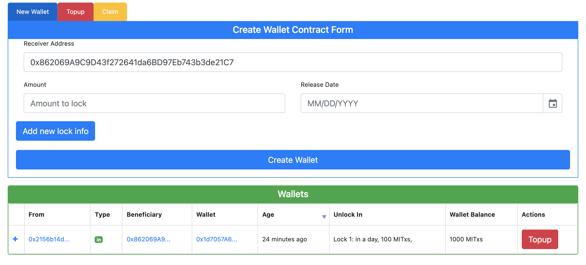
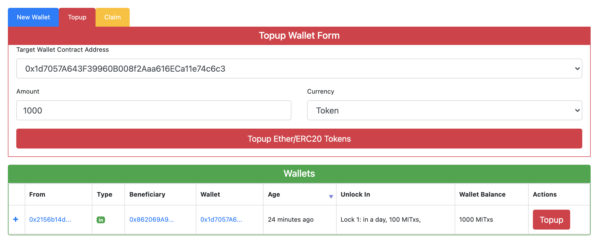
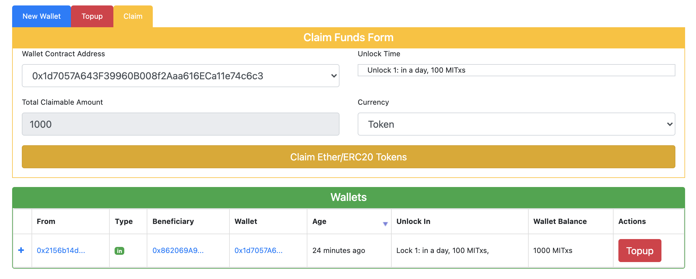

# Time Locked Wallets
There are many different applications of Ethereum smart contracts. The most popular at the moment are cryptocurrencies (implemented as ERC20 tokens) and how to deeal with funds. 
This idea itself has various use cases

## Vesting
Probably the most common reason at the moment to lock funds is called “vesting.” Imagine that you have just raised a successful crypto fund and your company still holds a majority of tokens distributed between your team members. It would be beneficial to all parties involved to ensure that the tokens held by employees cannot be traded straightaway. If there are no controls in place, any given employee might take action by selling all their tokens, cashing out, and quitting the company. 

## Trust Fund
Another application of locking funds could be to create a small fund or time-based savings account, i.e., one that prevents the owner from withdrawing any funds before a certain time in the future. (It could be particularly useful for addicted crypto traders in helping keep their ether/tokens intact.)

## Sample images
### Step1 - Create new time-locked wallet

### Step2 - TopUp funds in the time-locked wallet with tokens (ETH and any ERC20 token are supported)

### Step2 - The beneficiary address can claim funds from the multi-locked wallet

## How to start in local environment

1. Deploy TimeLockedWalletFactory.sol
2. Run `npm i` 
3. Run `npm run dev`
4. Access localhost:3000 to use

